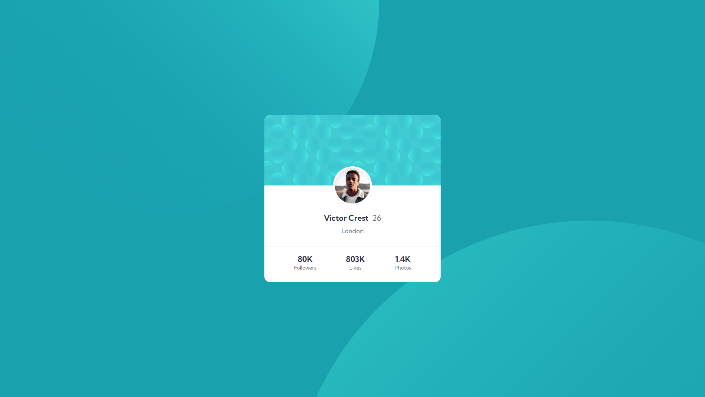

# Profile card component solution

## Table of contents

- [Overview](#overview)
  - [Screenshot](#screenshot)
  - [Links](#links)
- [My process](#my-process)
  - [Built with](#built-with)
  - [What I learned](#what-i-learned)
  - [Continued development](#continued-development)
- [Author](#author)

## Overview

### Screenshot



### Links

- Solution URL: [GitHub Repository](https://github.com/Luka-khokhashvili/Profile-card-component)
- Live Site URL: [GitHub Page](https://luka-khokhashvili.github.io/Profile-card-component/)

## My process

### Built with

- Semantic HTML5 markup
- CSS
- CSS Flexbox
- CSS Media Query for Responsivnes
- ```root:``` Color variables

### What I learned

Building this project was fun and challenging as well.
I improved my skills in writing better and cleaner code. I also gained a better understanding of the importance of the inspection tool and became better at using it.
At the same time, I would like to mention that I have improved even more in creating responsive design.

### Continued development

I continue to work on myself and my skills to further develop and improve in this field.
Every day I acquire and learn modern and different approaches to solving problems

## Author

- Website - [My Portfolio](https://luka-khokhashvili.github.io/Portfolio/)
- LinkedIn - [@luka-khokhashvili](https://www.linkedin.com/in/luka-khokhashvili-8179b7285/)
- GitHub - [@Luka-khokhashvili](https://github.com/Luka-khokhashvili)
